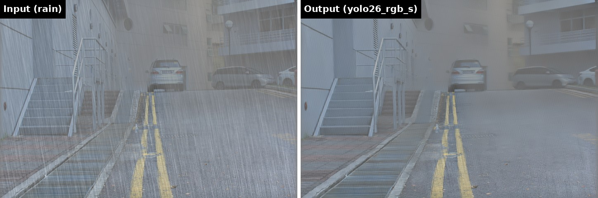
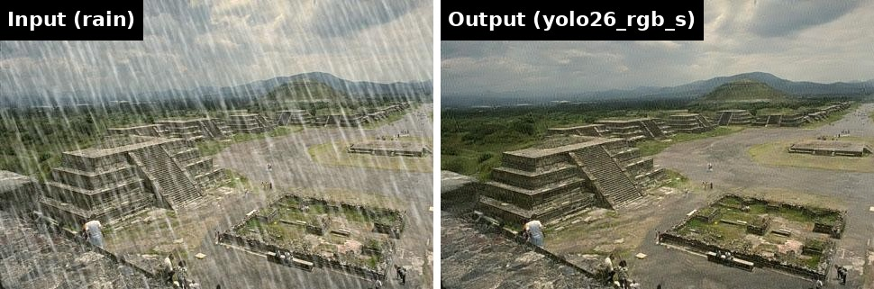
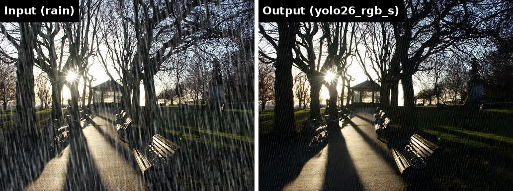

# yolo26-rgb

YOLO26's dense depth-estimation head, repurposed to output 3-channel RGB instead of 1-channel depth, for image restoration tasks (denoising, dehazing, deraining).

## Quickstart

End to end - load the model, derain one image, write a PNG (`pip install pillow` for the image I/O):

```python
import numpy as np, torch
from PIL import Image
from yolo26_rgb import YOLO26RGB

model = YOLO26RGB.from_pretrained("dronefreak/yolo26-rgb-s")  # or "dronefreak/yolo26-rgb-n"

# rainy image -> (1, 3, H, W) float in [0, 1]
img = Image.open("assets/rain_teotihuacan_pyramids.jpg").convert("RGB")
x = torch.from_numpy(np.array(img)).permute(2, 0, 1).float().div(255).unsqueeze(0)

with torch.no_grad():
    y = model(x).clamp(0, 1)          # residual output isn't bounded to [0, 1] - clamp it

out = y[0].mul(255).round().byte().permute(1, 2, 0).numpy()
Image.fromarray(out).save("derained.png")
```

`from_pretrained` parses the scale from the repo id, pulls `yolo26{scale}-rgb.pt` from the Hub (via `huggingface_hub`, cached normally), loads the trained weights, and returns the model in `eval()` mode on CPU - `.to("cuda")` afterwards if you want the GPU.

`model(x)` takes `(B, 3, H, W)` in `[0, 1]` and returns a bare `(B, 3, H, W)` tensor - no dict, no metadata, any input size (internally padded to a multiple of 32 and cropped back). Nothing else to unpack, so it drops straight into an existing restoration pipeline. One thing to know: the output itself is **not** clamped to `[0, 1]` (`RGBHead` predicts a residual correction added to the input, NAFNet/Restormer-style, rather than regressing a bounded image directly) - `.clamp(0, 1)` before saving/displaying as an image, as above.

## Models

| Model          | Params | Avg PSNR (9 rain-only) | Hugging Face                                                                |
| -------------- | ------ | ---------------------- | --------------------------------------------------------------------------- |
| `yolo26_rgb_n` | 5.25M  | 30.83                  | [`dronefreak/yolo26-rgb-n`](https://huggingface.co/dronefreak/yolo26-rgb-n) |
| `yolo26_rgb_s` | 12.13M | 30.95                  | [`dronefreak/yolo26-rgb-s`](https://huggingface.co/dronefreak/yolo26-rgb-s) |

`YOLO26RGB.from_pretrained(repo_id)` is the trained-model path (above). To build an **untrained** model instead - to train your own - use `YOLO26RGB(scale="s")` for random init, or `YOLO26RGB("yolo26s-depth.pt")` to start from YOLO26's depth-pretrained backbone with a random head (see the `yolo26_rgb.models.pretrained` module docstring for the lower-level download/extract/load functions).

## Why this exists

Detection and segmentation backbones are usually evaluated for cross-task transfer within vision (does a good detector also segment well), but rarely against dense pixel-regression restoration tasks like deraining. YOLO26 already ships a depth-estimation head, itself a dense, full-resolution regression task, which makes it a more interesting test case than a plain classification backbone. Classification-pretrained backbones (e.g. ResNet-UNet) are known to underperform purpose-built restoration architectures on rain removal despite far more parameters, a plausible reason being the classification-tuned stem's aggressive early downsampling losing fine rain-streak detail before any residual block runs. Swapping YOLO26's depth head for an RGB head is architecturally straightforward, since the decoder already upsamples to full input resolution, the open question is whether that decoder's inductive bias, tuned for real-time detection speed and then adapted once for depth, transfers to rain removal any better.

## Examples

Real photos, not part of the eval set below (`yolo26_rgb_s`):





Not perfect: up close, faint streaks survive on the worst case (dense rain over flat, low-texture backgrounds, first example above), see the AllWeather caveat below for where this breaks down harder. At normal viewing size it reads as a clear improvement in all three.

## Results

Deraining, evaluated on [ClearView](https://github.com/dronefreak/clearview)'s 10-test-set protocol (Rain100L/H, Test100/1200/2800, DDN-Data, SPA-Data, RealRain-1k-H/L, AllWeather), the same protocol ClearView uses to rank its own architectures. Ranked by ClearView's own convention, average PSNR across the 9 rain-only sets (AllWeather is an out-of-domain fog stress test every architecture scores ~13.5 dB on regardless of size, and is excluded from ranking for that reason).

The three deployment columns are TensorRT numbers, batch size 1, one engine build per model. `yolo26_rgb_n`/`_s` figures are measured on this exact setup; the baseline figures are ClearView's own published TensorRT benchmark, same GPU/TensorRT version, so directly comparable rather than a separately curated benchmark:

| Setting    | Value                                |
| ---------- | ------------------------------------ |
| GPU        | NVIDIA GeForce RTX 4070 SUPER (12GB) |
| Driver     | 580.173.02                           |
| CUDA       | 12.8                                 |
| cuDNN      | 9.8.0                                |
| TensorRT   | 11.2.1                               |
| OS         | Ubuntu 24.04.4 LTS                   |
| Resolution | 1920x1080                            |
| Precision  | fp16                                 |
| Batch size | 1                                    |

| Rank | Model               | Params     | Avg PSNR (9 rain-only) | Engine (fp16) | Latency (fp16) | Throughput (fp16) |
| ---- | ------------------- | ---------- | ---------------------- | ------------- | -------------- | ----------------- |
| 1    | Restormer [1]       | 15.3M      | 35.10                  | OOM\*         | OOM\*          | OOM\*             |
| 2    | NAFNet (Large) [3]  | 116M       | 34.16                  | 3.86 GB       | 1938.4 ms      | 0.52 qps          |
| 3    | NAFNet (Mid) [3]    | 14.3M      | 33.97                  | 1.85 GB       | 305.4 ms       | 3.3 qps           |
| 4    | Restormer-Small [1] | 2.3M       | 31.98                  | 7.2 GB        | 211.2 ms       | 4.7 qps           |
| 5    | UNet (Vanilla) [2]  | 21.5M      | 31.74                  | 44 MB         | 36.6 ms        | 27.3 qps          |
| 6    | NAFNet (Small) [3]  | 1.1M       | 31.15                  | 911 MB        | 37.2 ms        | 26.9 qps          |
| -    | **yolo26_rgb_s**    | **12.13M** | **30.95**              | **1.53 GB**   | **10.85 ms**   | **92.2 qps**      |
| -    | **yolo26_rgb_n**    | **5.25M**  | **30.83**              | **1.27 GB**   | **9.20 ms**    | **108.6 qps**     |
| 7    | ResNet50-UNet [4]   | 73.3M      | 30.63                  | 315 MB        | 30.2 ms        | 33.1 qps          |
| 8    | ResNet34-UNet [4]   | 24.5M      | 30.45                  | 217 MB        | 10.5 ms        | 94.9 qps          |
| 9    | ResNet18-UNet [4]   | 14.4M      | 30.23                  | 197 MB        | 9.07 ms        | 110.3 qps         |

\* Restormer's full-size checkpoint doesn't survive TensorRT conversion at this resolution: ONNX export itself OOMs at fp32 (over 12GB during tracing), and even at fp16 the TensorRT build fails, needing roughly 14.4GB of activation/scratch memory to fuse its attention path on a 12GB card. Reproduced on an idle GPU, a genuine memory ceiling, not contention from another process.

`n` and `s` beat every ResNet-UNet variant, including ResNet50-UNet at 6x the parameters, on the exact baseline this project set out to test against (a classification-pretrained backbone repurposed as a UNet encoder). Restormer/NAFNet still lead by a wide margin, expected for architectures built purely to maximize accuracy with no real-time or CPU-deployment constraint, and not the comparison this project is trying to win, see [Why this exists](#why-this-exists). Deployment tells a different story: the rank-1 model by PSNR doesn't run on this GPU at all, and both `yolo26_rgb` models beat or match the ResNet-UNet tier they sit closest to in PSNR on both latency and throughput.

Separately, on `n`: the depth-pretrained backbone beats a from-scratch (random-init) backbone on **10/10 test sets**, same recipe, 100 epochs, +0.483 dB PSNR / +0.0063 SSIM on average, real but modest, not a blowout. This is the actual question the pretrained-loading path in [`pretrained.py`](yolo26_rgb/models/pretrained.py) exists to answer.

One caveat worth stating plainly rather than smoothing over: AllWeather (the fog stress test, excluded above) sits at ~13.5 dB for both `n` and `s`, a stark outlier, not a soft weak point.

## Install

```bash
pip install -e .
```

Pulls in `torch` and `huggingface_hub` (the latter used only by `YOLO26RGB.from_pretrained`) - this release is the model itself, nothing else. Training and evaluation for the checkpoints in this repo used an external package, [ClearView](https://github.com/dronefreak/clearview) (data loading, mixed-domain training recipes, the 10-test-set eval protocol), but ClearView is not a dependency of this package and its training/eval scripts aren't included here.

## Structure

```text
yolo26_rgb/
└── models/
    ├── __init__.py       # get_model() registry
    ├── backbone.py        # original: YAML -> nn.Module builder + the layer-graph runner
    ├── heads.py            # original: RGBHead + the Yolo26RGB wrapper
    ├── pretrained.py       # download/extract/load a YOLO26 depth-pretrained backbone
    └── _vendor/            # Ultralytics YOLO26 source this depends on, AGPL-3.0, original copyright retained
        ├── blocks.py        # backbone/neck building blocks (Conv, C3k2, SPPF, C2PSA, Concat, ...)
        ├── depth_head.py     # the original 1-channel Depth head, RGBHead's structural reference
        ├── yolo26-depth.yaml # the original Ultralytics depth config, kept for reference
        └── yolo26-rgb.yaml   # this repo's actual config (same backbone/neck, RGBHead instead of Depth)
```

Just the model - this release doesn't include the training/evaluation scripts or mixed-domain configs used to produce the released checkpoints (see [Install](#install)).

`get_model("yolo26_rgb_n")` and `get_model("yolo26_rgb_s")` build the two released variants; each runs a forward+backward pass and returns a bare `(B, 3, H, W)` tensor at full input resolution (not a downsampled dict like the original depth head), and round-trips through `state_dict()` in a plain `{"model_state_dict": ...}` checkpoint format.

## License: AGPL-3.0

AGPL-3.0, see [LICENSE](LICENSE), inherited from depending on AGPL-licensed Ultralytics source, see the "why AGPL-3.0" section above.

Ultralytics' YOLO26 source is licensed AGPL-3.0 (or requires an Enterprise license for closed use, see [their licensing page](https://www.ultralytics.com/license)), which this repo inherits as a result of depending on it.

Any code copied or adapted from Ultralytics' YOLO26 source lives under [`yolo26_rgb/models/_vendor/`](yolo26_rgb/models/_vendor/), each file keeps its original Ultralytics copyright notice plus an AGPL-3.0 header. This is **not affiliated with or endorsed by Ultralytics**, it repurposes their published architecture for a different task, no claim of ownership over the original YOLO26 design.

## Citation

```bibtex
@software{saksena2026yolo26rgb,
  author = {Saksena, Saumya Kumaar},
  title = {yolo26-rgb: YOLO26's depth head repurposed for RGB image restoration},
  year = {2026},
  url = {https://github.com/dronefreak/yolo26-rgb}
}
```

Built on Ultralytics YOLO26, see [Ultralytics' licensing terms](https://www.ultralytics.com/license) for the underlying architecture. If citing the architecture this repo is built on:

```bibtex
@article{jocher2026yolo26,
  title = {Ultralytics YOLO26: Unified Real-Time End-to-End Vision Models},
  author = {Jocher, Glenn and Qiu, Jing and Liu, Mengyu and Lyu, Shuai and Akyon, Fatih Cagatay and Kalfaoglu, Muhammet Esat},
  year = {2026},
  eprint = {2606.03748},
  archivePrefix = {arXiv},
  primaryClass = {cs.CV},
  doi = {10.48550/arXiv.2606.03748},
  url = {https://arxiv.org/abs/2606.03748}
}

@software{ultralytics_yolo,
  author = {Jocher, Glenn and Qiu, Jing and Chaurasia, Ayush},
  title = {Ultralytics YOLO},
  version = {8.0.0},
  year = {2023},
  url = {https://github.com/ultralytics/ultralytics},
  license = {AGPL-3.0}
}
```

### References

Papers behind the baseline architectures in the [Results](#results) table above (numbers themselves are [ClearView](https://github.com/dronefreak/clearview)'s, not reproduced here):

1. Zamir et al., _Restormer: Efficient Transformer for High-Resolution Image Restoration_, CVPR 2022, [arXiv:2111.09881](https://arxiv.org/abs/2111.09881).
2. Ronneberger, Fischer & Brox, _U-Net: Convolutional Networks for Biomedical Image Segmentation_, MICCAI 2015, [arXiv:1505.04597](https://arxiv.org/abs/1505.04597).
3. Chen, Chu, Zhang & Sun, _Simple Baselines for Image Restoration_, ECCV 2022, [arXiv:2204.04676](https://arxiv.org/abs/2204.04676) (NAFNet).
4. He, Zhang, Ren & Sun, _Deep Residual Learning for Image Recognition_, CVPR 2016, [arXiv:1512.03385](https://arxiv.org/abs/1512.03385) (ResNet, the encoder backbone for the ResNet18/34/50-UNet baselines).
